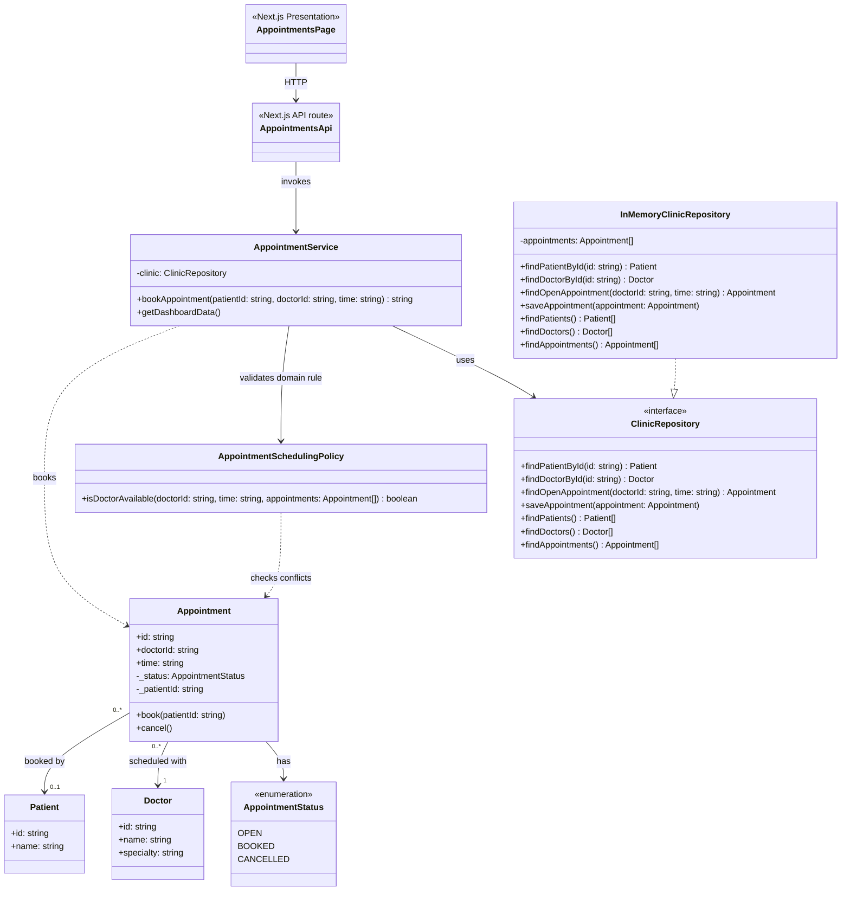

# Lab 9 - Clinic appointment class diagram

```mermaid
classDiagram
    class Patient {
        +id: string
        +name: string
    }

    class Doctor {
        +id: string
        +name: string
        +specialty: string
    }

    class Appointment {
        +id: string
        +doctorId: string
        +time: string
        -_status: AppointmentStatus
        -_patientId: string
        +book(patientId: string)
        +cancel()
    }

    class AppointmentStatus {
        <<enumeration>>
        OPEN
        BOOKED
        CANCELLED
    }

    class AppointmentSchedulingPolicy {
        +isDoctorAvailable(doctorId: string, time: string, appointments: Appointment[]) boolean
    }

    class ClinicRepository {
        <<interface>>
        +findPatientById(id: string) Patient
        +findDoctorById(id: string) Doctor
        +findOpenAppointment(doctorId: string, time: string) Appointment
        +saveAppointment(appointment: Appointment)
        +findPatients() Patient[]
        +findDoctors() Doctor[]
        +findAppointments() Appointment[]
    }

    class AppointmentService {
        -clinic: ClinicRepository
        +bookAppointment(patientId: string, doctorId: string, time: string) string
        +getDashboardData()
    }

    class InMemoryClinicRepository {
        -appointments: Appointment[]
        +findPatientById(id: string) Patient
        +findDoctorById(id: string) Doctor
        +findOpenAppointment(doctorId: string, time: string) Appointment
        +saveAppointment(appointment: Appointment)
        +findPatients() Patient[]
        +findDoctors() Doctor[]
        +findAppointments() Appointment[]
    }

    class AppointmentsPage {
        <<Next.js Presentation>>
    }

    class AppointmentsApi {
        <<Next.js API route>>
    }

    Appointment --> AppointmentStatus : has
    Appointment "0..*" --> "1" Doctor : scheduled with
    Appointment "0..*" --> "0..1" Patient : booked by
    AppointmentSchedulingPolicy ..> Appointment : checks conflicts
    InMemoryClinicRepository ..|> ClinicRepository
    AppointmentService --> ClinicRepository : uses
    AppointmentService --> AppointmentSchedulingPolicy : validates domain rule
    AppointmentService ..> Appointment : books
    AppointmentsPage --> AppointmentsApi : HTTP
    AppointmentsApi --> AppointmentService : invokes
```
