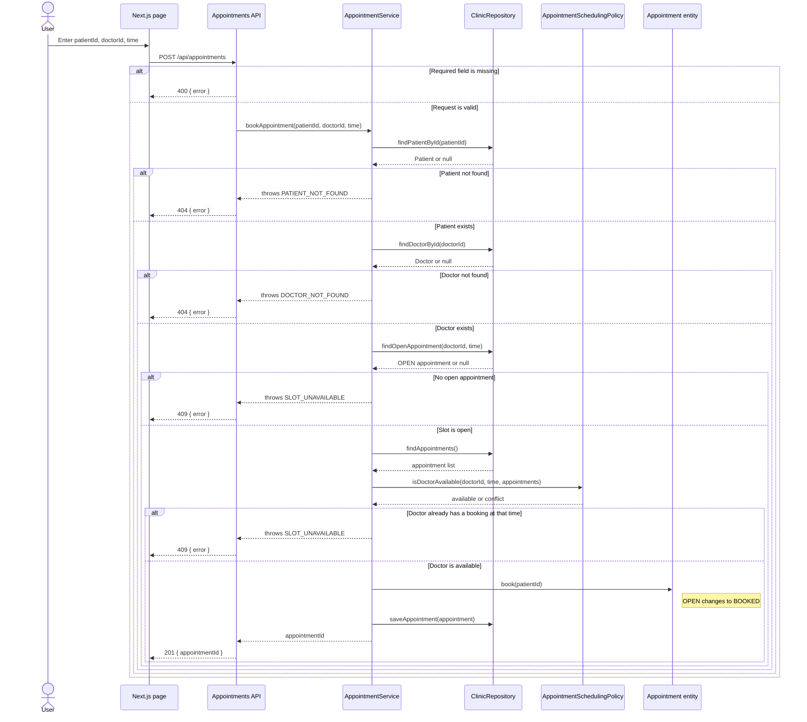

# Lab 9 - Book clinic appointment sequence diagram

```mermaid
sequenceDiagram
    actor Patient as User
    participant Page as Next.js page
    participant API as Appointments API
    participant Service as AppointmentService
    participant Repository as ClinicRepository
    participant Policy as AppointmentSchedulingPolicy
    participant Appointment as Appointment entity

    Patient->>Page: Enter patientId, doctorId, time
    Page->>API: POST /api/appointments
    alt Required field is missing
        API-->>Page: 400 { error }
    else Request is valid
        API->>Service: bookAppointment(patientId, doctorId, time)
        Service->>Repository: findPatientById(patientId)
        Repository-->>Service: Patient or null
        alt Patient not found
            Service-->>API: throws PATIENT_NOT_FOUND
            API-->>Page: 404 { error }
        else Patient exists
            Service->>Repository: findDoctorById(doctorId)
            Repository-->>Service: Doctor or null
            alt Doctor not found
                Service-->>API: throws DOCTOR_NOT_FOUND
                API-->>Page: 404 { error }
            else Doctor exists
                Service->>Repository: findOpenAppointment(doctorId, time)
                Repository-->>Service: OPEN appointment or null
                alt No open appointment
                    Service-->>API: throws SLOT_UNAVAILABLE
                    API-->>Page: 409 { error }
                else Slot is open
                    Service->>Repository: findAppointments()
                    Repository-->>Service: appointment list
                    Service->>Policy: isDoctorAvailable(doctorId, time, appointments)
                    Policy-->>Service: available or conflict
                    alt Doctor already has a booking at that time
                        Service-->>API: throws SLOT_UNAVAILABLE
                        API-->>Page: 409 { error }
                    else Doctor is available
                        Service->>Appointment: book(patientId)
                        Note right of Appointment: OPEN changes to BOOKED
                        Service->>Repository: saveAppointment(appointment)
                        Service-->>API: appointmentId
                        API-->>Page: 201 { appointmentId }
                    end
                end
            end
        end
    end
```
